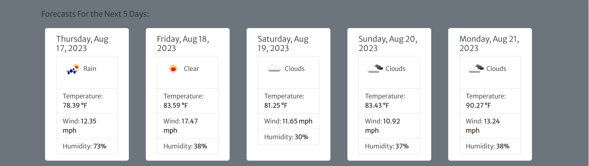

# Weather Dashboard App

With the purpose of providing a practical App with an intuitive UI that helps people which American city to visit (or what activities to plan for a given day, if they already are or must be in the city)., we have designed the Weather Dashboard App. This App employs the trustworthy weather reportss and forecasts provided by the Open Weather API and the 5 Day Weather Forecast API to provide reliable information to the user in a visually engaging form. In order to ensure the accuracy of the city locations, we employ the geocoding API in order to convert the user's input (city and state/U.S. territory) into coordinates that are passed into the two other APIs as part of the query parameters employed during the fetch requests. The information retrieved is presented in imperial units and includes: date (formatted using both dayjs and the js native Date()), temperature (in Fahrenheit degrees), wind speed (in mph), and humidity(%). Additionally, one of the icons whose images are included in the images folder is supposed to show up, giving a general indication of the weather conditions. This project was an opportunity to practice the use of CSS frameworks(Bootstrap, including using the Grid), the Day.js JavaScript library, storing and retrieving from client-side storage, and, especially, the use of the in-browser fetch API in order to make requests to server-side APIs.

## Usage

The application is currently deployed in GitHub pages at the following URL: https://jguemarez.github.io/WeatherDashApp/.
The following screenshots where taken from a rendering of the page using Google Chrome Version 115.0.5790.171 (Official Build) (64-bit).

When the page loads, the user will be displayed two text input fields, one for the city name and the other for the state or territory it lies in, as well as a min card titles "Last City Searched"

On the other hand, if the user had already visited the page, then the name of the last city he/she searched for will be displayed, even if the user refreshes the page.

An alert reminds the user that both input fields need to be filled in:

Thanks to local storage, the user can inquire the search history by pressing the link in the nav bar. Clicking on a button with a city and territory name on it will result in a new search, providing info about the current weather and forecasts for the days that follow.In addition, the user can decide whether to close the search history or even delete it.

The forecast for the next five days can read in the small cards at the bottom of the page.

## Authorship

This Web App is of the authorship of Jonathan Maldonado Guemarez. The public repo can be found at :
https://github.com/jguemarez/WeatherDashApp

The Normalize.css (used to do a CSS reset) was downloaded from: https://necolas.github.io/normalize.css/

The .gitignore file was taken from the BootCamp repo located at: https://git.bootcampcontent.com/

The .png files with distict weather icons where retrieved from the Wether Conditions page at the OpenWeather.org website: https://openweathermap.org/weather-conditions

## Support

You can reach me concerning any doubts at: cantor.dedekind112358@gmail.com.

## Contributing

Any constructive criticism is welcome. Please open an issue to review before enacting any change to the code.

## License

This open-source project is licensed under the 
[MIT](https://choosealicense.com/licenses/mit/) license. Please click the link for more information.

